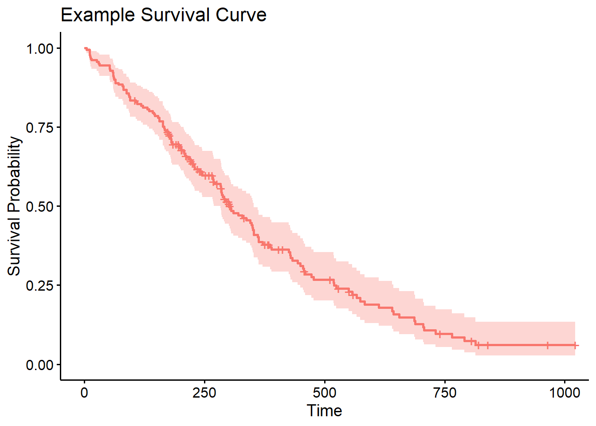

# Cox Proportional Hazards Model

## Authors
#### Jayme Reed & Brad Paton

## Abstract

This paper investigates the application of the Cox proportional hazards model to model and predict the survival probabilities of aircraft engines. Given the complexity and critical nature of aircraft safety, accurate survival analysis of engine performance data is essential for effective maintenance scheduling and risk management. 

In this paper, a dataset comprising operational metrics, sensor measurements, and number of iterations comprise a series of metrics used to build an effective model. The analysis demonstrates that the Cox model effectively captures the relationship between various covariates and their impact on survival probabilities. The model is validated using a second dataset to compare to the data used to train the model, showcasing its predictive accuracy and reliability. 

The results highlight the potential impacts of multiple variables on survival probability that could be applied to enhancing predictive maintenance strategies to reduce the number of unexpected engine failures and improving aircraft safety. This research contributes to the field of aviation engineering by providing a statistical basis for decision-making in engine maintenance and operational practices.

#### Links:

- [Dataset Source](https://data.nasa.gov/Aerospace/CMAPSS-Jet-Engine-Simulated-Data/ff5v-kuh6/about_data)
- [Link to the Paper's Website](https://jr-87.github.io/capstone4ds_reed/)

